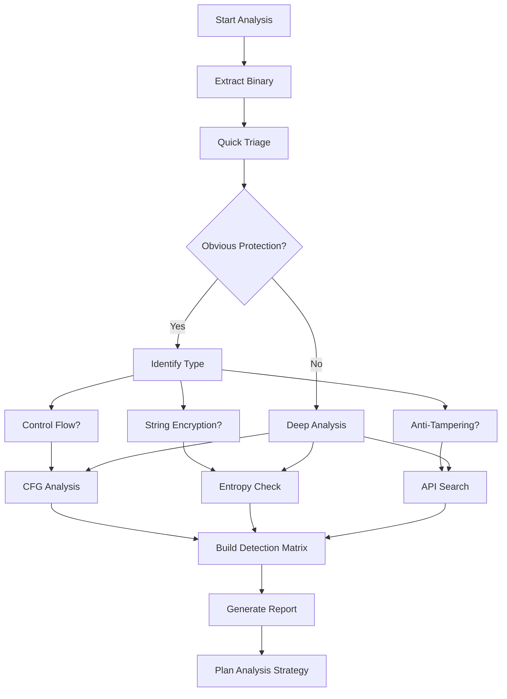

Successful reverse engineering of obfuscated code begins with accurately identifying which obfuscation techniques have been applied. This guide covers systematic detection strategies.

## Initial Triage

Before diving deep into analysis, perform a quick assessment to understand what you're dealing with.

<Steps>
  <Step title="Basic Binary Analysis">
    ```bash
    # File type and architecture
    file binary_name
    
    # Check if stripped
    nm binary_name | wc -l
    
    # Identify encryption
    otool -l binary_name | grep -A 5 LC_ENCRYPTION_INFO
    
    # List dependencies
    otool -L binary_name
    ```
  </Step>

  <Step title="String Analysis">
    ```bash
    # Extract strings
    strings binary_name > strings.txt
    
    # Count meaningful strings
    wc -l strings.txt
    
    # Look for patterns
    grep -E '^[A-Za-z0-9+/]{20,}={0,2}$' strings.txt  # Base64
    grep -E '^[0-9a-fA-F]{32,}$' strings.txt          # Hex
    ```
    
    <Info>
      Few readable strings suggest string encryption or minimization.
    </Info>
  </Step>

  <Step title="Symbol Table Inspection">
    ```bash
    # List symbols
    nm -a binary_name | head -50
    
    # Count Objective-C classes
    otool -oV binary_name | grep "class_name" | wc -l
    
    # Check for symbol obfuscation
    nm binary_name | grep -E '^[a-z]$'  # Single char names
    ```
  </Step>

  <Step title="Code Size Analysis">
    ```bash
    # Segment sizes
    otool -l binary_name | grep -A 3 "segname __TEXT"
    
    # Section details
    size binary_name
    ```
    
    <Tip>
      Unusually large code sections may indicate dead code injection.
    </Tip>
  </Step>
</Steps>

## Identifying Obfuscation Types

<Tabs>
  <Tab title="Control Flow">
    ### Control Flow Flattening Indicators
    
    <AccordionGroup>
      <Accordion title="Static Analysis" icon="file-code">
        **Disassembly Patterns:**
        ```asm
        ; Dispatcher loop pattern
        .loop_start:
            ldr     w8, [sp, #state_var]
            cmp     w8, #0
            b.eq    .case_0
            cmp     w8, #1
            b.eq    .case_1
            cmp     w8, #2
            b.eq    .case_2
            ; ... many cases
        
        .case_0:
            ; block code
            mov     w8, #next_state
            str     w8, [sp, #state_var]
            b       .loop_start
        ```
        
        **Key Indicators:**
        - Central dispatch loop with switch/jump table
        - State variable controlling flow
        - All basic blocks at same nesting level
        - Unconditional jumps back to dispatcher
      </Accordion>
      
      <Accordion title="CFG Analysis" icon="diagram-nodes">
        Use tools to visualize control flow graphs:
        
        ```bash
        # Generate CFG with radare2
        r2 -A binary_name
        [0x100000000]> s main
        [0x100001234]> ag  # ASCII graph
        [0x100001234]> agf > cfg.dot  # Graphviz format
        
        # Visualize
        dot -Tpng cfg.dot -o cfg.png
        ```
        
        **Look for:**
        - Star topology (all blocks connect to center)
        - High fan-in to dispatcher block
        - Flat structure (no natural hierarchy)
        - Many back-edges to single block
      </Accordion>
      
      <Accordion title="Metrics" icon="chart-line">
        Calculate complexity metrics:
        
        ```python
        import r2pipe
        
        r2 = r2pipe.open("binary_name")
        r2.cmd("aaa")  # Analyze all
        
        # Get function info
        funcs = r2.cmdj("aflj")  # JSON format
        
        for func in funcs:
            name = func.get("name")
            cyclomatic = func.get("cc", 0)  # Cyclomatic complexity
            nbbs = func.get("nbbs", 0)      # Number of basic blocks
            
            # High complexity with many blocks suggests flattening
            if cyclomatic > 50 and nbbs > 20:
                print(f"[!] Suspicious: {name}")
                print(f"    Complexity: {cyclomatic}")
                print(f"    Basic blocks: {nbbs}")
        ```
      </Accordion>
    </AccordionGroup>
  </Tab>
  
  <Tab title="String Encryption">
    ### String Obfuscation Detection
    
    <CodeGroup>
    ```bash Entropy Analysis
    # Calculate entropy of data sections
    import math
    from collections import Counter
    
    def calculate_entropy(data):
        if not data:
            return 0
        
        entropy = 0
        counter = Counter(data)
        length = len(data)
        
        for count in counter.values():
            probability = count / length
            entropy -= probability * math.log2(probability)
        
        return entropy
    
    # Read binary sections
    with open('binary_name', 'rb') as f:
        data = f.read()
    
    # High entropy (>7.0) suggests encryption
    entropy = calculate_entropy(data)
    print(f"Entropy: {entropy:.2f}")
    ```
    
    ```bash Pattern Recognition
    # Look for decryption function patterns
    strings binary_name | grep -i "decrypt\|deobfuscate\|decode"
    
    # Search for XOR operations in assembly
    r2 -A binary_name
    [0x100000000]> /c eor  # Search for XOR instructions
    
    # Find Base64 decoding
    nm binary_name | grep -i base64
    ```
    
    ```python Dynamic Detection
    # Frida script to detect string decryption
    import frida
    
    script_code = """
    var stringCreations = [];
    
    // Hook NSString creation
    var NSString = ObjC.classes.NSString;
    Interceptor.attach(
        NSString['- initWithBytes:length:encoding:'].implementation,
        {
            onEnter: function(args) {
                this.length = args[3].toInt32();
                this.data = args[2];
            },
            onLeave: function(retval) {
                if (this.length > 5) {
                    var str = ObjC.Object(retval).toString();
                    
                    // Check if string wasn't in binary
                    stringCreations.push(str);
                    
                    if (stringCreations.length % 10 === 0) {
                        console.log('[+] Decrypted strings: ' + 
                                    stringCreations.length);
                    }
                }
            }
        }
    );
    """;
    ```
    </CodeGroup>
    
    **Indicators:**
    - Absence of expected strings in static analysis
    - Presence of high-entropy byte arrays
    - Crypto library imports (CommonCrypto, OpenSSL)
    - Functions with XOR, shift, or substitution patterns
    - Runtime string creation from byte arrays
  </Tab>
  
  <Tab title="Symbol Obfuscation">
    ### Detecting Symbol Renaming
    
    ```bash
    # Extract and analyze symbols
    nm binary_name > symbols.txt
    
    # Count single-character symbols
    grep -E '^[0-9a-f]+ [A-Z] [a-z]$' symbols.txt | wc -l
    
    # Look for patterns
    grep -E '^[0-9a-f]+ [A-Z] (a|b|c|aa|ab|a1|a2)$' symbols.txt
    
    # Check class names
    otool -oV binary_name | grep "class_name" | head -20
    ```
    
    **Red Flags:**
    
    <CardGroup cols={2}>
      <Card title="Short Names" icon="text">
        Class and method names like `a`, `b`, `c` instead of descriptive names.
      </Card>
      
      <Card title="Sequential Patterns" icon="list-ol">
        Names following patterns: `a1`, `a2`, `a3` or `func_1`, `func_2`.
      </Card>
      
      <Card title="Random Strings" icon="shuffle">
        Completely random names like `xK7pQ2m` with no semantic meaning.
      </Card>
      
      <Card title="Missing Prefixes" icon="tag">
        Objective-C classes without standard prefixes (NS, UI, etc.).
      </Card>
    </CardGroup>
    
    ### Analysis Script
    
    ```python
    import re
    from collections import Counter
    
    def analyze_symbols(symbol_file):
        with open(symbol_file, 'r') as f:
            symbols = f.readlines()
        
        # Extract symbol names
        names = []
        for line in symbols:
            match = re.search(r'[A-Z] (\w+)', line)
            if match:
                names.append(match.group(1))
        
        # Statistics
        single_char = sum(1 for n in names if len(n) == 1)
        short_names = sum(1 for n in names if len(n) <= 3)
        
        print(f"Total symbols: {len(names)}")
        print(f"Single character: {single_char} "
              f"({single_char/len(names)*100:.1f}%)")
        print(f"3 chars or less: {short_names} "
              f"({short_names/len(names)*100:.1f}%)")
        
        # If >30% are very short, likely obfuscated
        if short_names / len(names) > 0.3:
            print("\n[!] Symbol obfuscation detected")
            return True
        
        return False
    
    analyze_symbols('symbols.txt')
    ```
  </Tab>
  
  <Tab title="Anti-Tampering">
    ### Runtime Protection Detection
    
    <Steps>
      <Step title="Search for Protection APIs">
        ```bash
        # Look for common APIs
        nm binary_name | grep -i "ptrace\|sysctl\|fork\|dlopen"
        
        # Search in disassembly
        r2 -A binary_name
        [0x100000000]> afl | grep -i "check\|detect\|verify\|validate"
        
        # Find syscalls
        r2 -A binary_name
        [0x100000000]> /c svc  # System calls on ARM
        ```
      </Step>
      
      <Step title="String Search">
        ```bash
        # Jailbreak detection indicators
        strings binary_name | grep -i \
          "cydia\|substrate\|jailbreak\|icy\|apt\|ssh\|bash"
        
        # Debugger detection
        strings binary_name | grep -i \
          "debug\|lldb\|gdb\|trace\|breakpoint"
        ```
      </Step>
      
      <Step title="Code Pattern Search">
        ```python
        # Search for ptrace(PT_DENY_ATTACH) pattern
        import r2pipe
        
        r2 = r2pipe.open("binary_name")
        r2.cmd("aaa")
        
        # Find ptrace calls
        ptrace_refs = r2.cmdj("/j ptrace")
        
        for ref in ptrace_refs:
            addr = ref.get("offset")
            
            # Disassemble around the call
            r2.cmd(f"s {addr}")
            disasm = r2.cmd("pd 10 @ {}".format(addr - 20))
            
            # Look for PT_DENY_ATTACH (31 or 0x1f)
            if "#31" in disasm or "#0x1f" in disasm:
                print(f"[!] PT_DENY_ATTACH at {hex(addr)}")
        ```
      </Step>
    </Steps>
    
    **Protection Checklist:**
    
    <Tabs>
      <Tab title="Environment">
        - [ ] Jailbreak file checks
        - [ ] Suspicious dylib detection
        - [ ] Symbolic link verification
        - [ ] Privilege escalation tests
        - [ ] System file integrity checks
      </Tab>
      
      <Tab title="Debugging">
        - [ ] ptrace(PT_DENY_ATTACH)
        - [ ] sysctl P_TRACED check
        - [ ] Exception port monitoring
        - [ ] Breakpoint detection
        - [ ] Timing checks (anti-analysis)
      </Tab>
      
      <Tab title="Integrity">
        - [ ] Code signature validation
        - [ ] Binary checksum verification
        - [ ] Memory tamper detection
        - [ ] Resource modification checks
      </Tab>
    </Tabs>
  </Tab>
</Tabs>

## Automated Detection Tools

<CardGroup cols={2}>
  <Card title="DIE (Detect It Easy)" icon="wand-magic-sparkles">
    Cross-platform tool for detecting packers, obfuscators, and compilers.
    
    ```bash
    # Install
    brew install detect-it-easy
    
    # Analyze binary
    diec binary_name
    ```
  </Card>
  
  <Card title="r2pipe Scripts" icon="code">
    Custom detection scripts using radare2 Python bindings.
    
    ```python
    import r2pipe
    r2 = r2pipe.open("binary")
    r2.cmd("aaa")
    info = r2.cmdj("ij")
    ```
  </Card>
  
  <Card title="MobSF" icon="mobile">
    Mobile Security Framework with obfuscation detection.
    
    ```bash
    # Run analysis
    python3 manage.py runserver
    # Upload IPA via web interface
    ```
  </Card>
  
  <Card title="Ghidra Scripts" icon="dragon">
    Custom Ghidra analyzers for pattern detection.
    
    ```java
    // FlatteningDetector.java
    // Custom Ghidra script
    ```
  </Card>
</CardGroup>

## Pattern Recognition

### Building a Detection Matrix

<Info>
  Create a systematic checklist to identify multiple obfuscation techniques simultaneously.
</Info>

```python
class ObfuscationDetector:
    def __init__(self, binary_path):
        self.binary = binary_path
        self.results = {}
    
    def detect_all(self):
        print("[*] Analyzing {}\n".format(self.binary))
        
        self.results['control_flow'] = self.check_control_flow()
        self.results['strings'] = self.check_string_encryption()
        self.results['symbols'] = self.check_symbol_obfuscation()
        self.results['anti_debug'] = self.check_anti_debug()
        self.results['anti_jailbreak'] = self.check_anti_jailbreak()
        
        self.print_report()
    
    def check_control_flow(self):
        # Analyze CFG complexity
        return {
            'detected': True,
            'confidence': 'high',
            'evidence': ['High cyclomatic complexity', 'Dispatcher pattern']
        }
    
    def check_string_encryption(self):
        # Entropy analysis
        return {
            'detected': True,
            'confidence': 'medium',
            'evidence': ['High entropy sections', 'Few readable strings']
        }
    
    def check_symbol_obfuscation(self):
        # Symbol analysis
        return {
            'detected': True,
            'confidence': 'high',
            'evidence': ['40% single-char symbols']
        }
    
    def check_anti_debug(self):
        # API detection
        return {
            'detected': True,
            'confidence': 'high',
            'evidence': ['ptrace calls', 'sysctl checks']
        }
    
    def check_anti_jailbreak(self):
        # File/path checks
        return {
            'detected': True,
            'confidence': 'high',
            'evidence': ['Cydia path checks', 'fork attempts']
        }
    
    def print_report(self):
        print("=" * 60)
        print("OBFUSCATION DETECTION REPORT")
        print("=" * 60)
        
        for technique, result in self.results.items():
            status = "[DETECTED]" if result['detected'] else "[NOT FOUND]"
            print(f"\n{status} {technique.replace('_', ' ').title()}")
            print(f"  Confidence: {result['confidence']}")
            print(f"  Evidence:")
            for evidence in result['evidence']:
                print(f"    - {evidence}")

# Usage
detector = ObfuscationDetector('binary_name')
detector.detect_all()
```

## Workflow Diagram



## Best Practices

<AccordionGroup>
  <Accordion title="Start Broad, Then Focus" icon="funnel">
    Begin with automated tools and high-level indicators before diving into detailed analysis. This saves time and helps prioritize efforts.
  </Accordion>
  
  <Accordion title="Combine Static and Dynamic" icon="code-compare">
    Static analysis alone can miss runtime obfuscation. Dynamic analysis alone can miss dormant protections. Use both approaches.
  </Accordion>
  
  <Accordion title="Document Everything" icon="file-pen">
    Keep detailed notes on detected techniques, evidence, and confidence levels. This helps when returning to the analysis later.
  </Accordion>
  
  <Accordion title="Build a Reference Library" icon="book">
    Maintain a collection of known obfuscation patterns, tool outputs, and bypass techniques for future reference.
  </Accordion>
  
  <Accordion title="Iterate and Refine" icon="arrows-rotate">
    Initial detection may be incomplete. As you analyze deeper, you may discover additional obfuscation layers. Update your assessment.
  </Accordion>
</AccordionGroup>

## Common Pitfalls

<Warning>
  **False Positives**: Compiler optimizations can resemble obfuscation. Verify with multiple indicators before concluding obfuscation is present.
</Warning>

<Warning>
  **Layered Obfuscation**: Detecting one technique doesn't mean there aren't others. Always check for multiple simultaneous techniques.
</Warning>

<Warning>
  **Evolving Techniques**: Obfuscators constantly evolve. Patterns that worked yesterday may not apply to new versions. Stay current.
</Warning>

## Further Reading

<CardGroup cols={2}>
  <Card title="Obfuscation Overview" icon="mask" href="/obfuscation/overview">
    Return to the overview for context on why obfuscation is used.
  </Card>
  
  <Card title="Control Flow Flattening" icon="diagram-project" href="/obfuscation/control-flow-flattening">
    Deep dive into analyzing detected control flow obfuscation.
  </Card>
  
  <Card title="String Encryption" icon="key" href="/obfuscation/string-encryption">
    Learn to extract and decrypt obfuscated strings.
  </Card>
  
  <Card title="Anti-Tampering" icon="shield-check" href="/obfuscation/anti-tampering">
    Bypass detected runtime protections.
  </Card>
</CardGroup>
