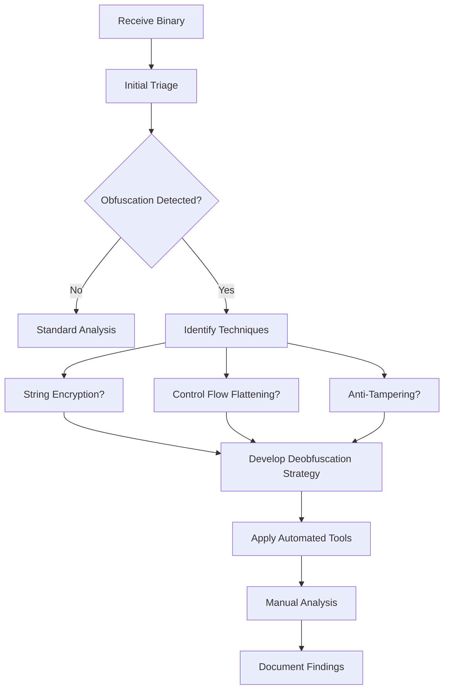

Obfuscation is a critical defense mechanism used by iOS developers to protect their applications from reverse engineering, tampering, and intellectual property theft.

## Why Obfuscation is Used

<AccordionGroup>
  <Accordion title="Protect Intellectual Property" icon="shield-halved">
    Obfuscation helps protect proprietary algorithms, business logic, and trade secrets from being easily extracted and copied by competitors.
  </Accordion>

  <Accordion title="Prevent Tampering" icon="lock">
    By making code harder to understand and modify, obfuscation raises the bar for attackers attempting to bypass license checks, inject malicious code, or crack security mechanisms.
  </Accordion>

  <Accordion title="Deter Piracy" icon="ban">
    Obfuscated apps are more difficult to crack and redistribute, helping to protect revenue from premium features and in-app purchases.
  </Accordion>

  <Accordion title="Compliance Requirements" icon="file-contract">
    Some industries require obfuscation as part of security compliance standards to protect sensitive data and business logic.
  </Accordion>
</AccordionGroup>

## Common Obfuscation Techniques in iOS

<CardGroup cols={2}>
  <Card title="Control Flow Flattening" icon="diagram-project" href="/obfuscation/control-flow-flattening">
    Transforms code structure to hide the original program logic and execution flow.
  </Card>

  <Card title="String Encryption" icon="key" href="/obfuscation/string-encryption">
    Encrypts string literals to hide sensitive information and API endpoints.
  </Card>

  <Card title="Symbol Obfuscation" icon="hashtag">
    Renames classes, methods, and variables to meaningless names like `a`, `b`, `c`.
  </Card>

  <Card title="Anti-Tampering" icon="shield-check" href="/obfuscation/anti-tampering">
    Detects jailbreaks, debuggers, and code modifications at runtime.
  </Card>

  <Card title="Dead Code Injection" icon="code">
    Adds non-functional code paths to confuse analysis and increase complexity.
  </Card>

  <Card title="Instruction Substitution" icon="shuffle">
    Replaces simple instructions with complex equivalent sequences.
  </Card>
</CardGroup>

## Impact on Reverse Engineering

<Steps>
  <Step title="Increased Analysis Time">
    Reverse engineers must spend significantly more time understanding obfuscated code, often turning hours of work into days or weeks.
  </Step>

  <Step title="Reduced Accuracy">
    Automated tools like decompilers produce less readable output, forcing analysts to rely more on manual analysis.
  </Step>

  <Step title="Higher Skill Requirements">
    Successfully analyzing obfuscated code requires advanced knowledge of assembly language, compiler optimizations, and obfuscation patterns.
  </Step>

  <Step title="Tool Limitations">
    Standard reverse engineering tools may fail or produce incorrect results when confronted with advanced obfuscation techniques.
  </Step>
</Steps>

<Warning>
  Obfuscation is **not encryption**. While it significantly raises the difficulty of reverse engineering, a determined and skilled attacker can still analyze obfuscated code given enough time and resources.
</Warning>

## Detection Strategies

Identifying obfuscation is the first step in developing an effective analysis strategy.

### Static Analysis Indicators

<CodeGroup>
```swift Normal Code
func validateUser(username: String, password: String) -> Bool {
    if username.isEmpty || password.isEmpty {
        return false
    }
    return authenticate(username, password)
}
```

```swift Obfuscated Code
func a(_ b: String, _ c: String) -> Bool {
    var d = 0
    while true {
        switch d {
        case 0:
            if b.isEmpty { d = 1 } else { d = 2 }
        case 1:
            return false
        case 2:
            if c.isEmpty { d = 1 } else { d = 3 }
        case 3:
            return e(b, c)
        default:
            return false
        }
    }
}
```
</CodeGroup>

### Key Detection Patterns

<Tabs>
  <Tab title="Control Flow">
    - Excessive use of switch statements with numeric cases
    - Unnatural loop structures that don't match typical patterns
    - High cyclomatic complexity for simple operations
    - Dispatcher variables controlling execution flow
  </Tab>

  <Tab title="Symbols">
    - Single-character class and method names
    - Sequential naming patterns (a, b, c or a1, a2, a3)
    - Missing meaningful variable names
    - Inconsistent naming conventions
  </Tab>

  <Tab title="Strings">
    - Base64 or hex-encoded string literals
    - Runtime string decryption functions
    - Absence of readable strings in binary
    - XOR or custom encryption algorithms
  </Tab>

  <Tab title="Runtime">
    - Anti-debugging checks at startup
    - Integrity verification of code segments
    - Jailbreak detection routines
    - Unusual system calls and API usage
  </Tab>
</Tabs>

## Analysis Workflow



<Tip>
  Use the [detection techniques](/obfuscation/detection-techniques) guide to systematically identify and classify obfuscation methods in your target application.
</Tip>

## Next Steps

<CardGroup cols={2}>
  <Card title="Control Flow Flattening" icon="diagram-project" href="/obfuscation/control-flow-flattening">
    Learn how to identify and analyze flattened control flow structures.
  </Card>

  <Card title="String Encryption" icon="key" href="/obfuscation/string-encryption">
    Discover techniques for decrypting obfuscated strings at runtime.
  </Card>

  <Card title="Anti-Tampering" icon="shield-check" href="/obfuscation/anti-tampering">
    Understand and bypass jailbreak and debugger detection mechanisms.
  </Card>

  <Card title="Detection Techniques" icon="magnifying-glass" href="/obfuscation/detection-techniques">
    Master the tools and techniques for detecting obfuscation patterns.
  </Card>
</CardGroup>
