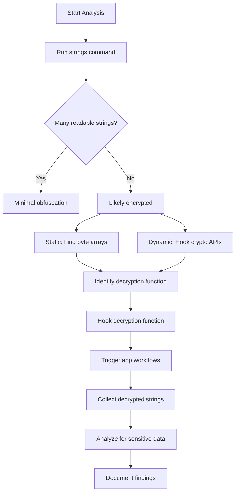

String encryption is a fundamental obfuscation technique used to hide sensitive information like API keys, URLs, encryption keys, and debug messages from static analysis.

## Why Encrypt Strings?

<CardGroup cols={2}>
  <Card title="Hide Sensitive Data" icon="eye-slash">
    API keys, URLs, and credentials are invisible in disassembled code.
  </Card>

  <Card title="Prevent Patching" icon="shield">
    Critical strings can't be easily modified to bypass security checks.
  </Card>

  <Card title="Obscure Logic" icon="mask">
    Error messages and debug strings that reveal program logic are hidden.
  </Card>

  <Card title="Compliance" icon="check-circle">
    Meet security requirements that prohibit hardcoded secrets.
  </Card>
</CardGroup>

## String Obfuscation Techniques

<Tabs>
  <Tab title="XOR Encryption">
    Simple but effective byte-wise XOR with a key:
    
    ```swift
    // Encrypted string (compile-time)
    let encrypted: [UInt8] = [0x72, 0x65, 0x6C, 0x6C, 0x6F]
    let key: UInt8 = 0x42
    
    // Decrypt at runtime
    func decrypt(_ data: [UInt8], key: UInt8) -> String {
        let decrypted = data.map { $0 ^ key }
        return String(bytes: decrypted, encoding: .utf8)!
    }
    
    let apiKey = decrypt(encrypted, key: key)
    // Result: "Hello"
    ```
    
    <Info>
      XOR is reversible: `(data ^ key) ^ key = data`
    </Info>
  </Tab>

  <Tab title="Base64 + Encoding">
    Combine Base64 encoding with character substitution:
    
    ```swift
    // Original: "https://api.example.com"
    // Base64: "aHR0cHM6Ly9hcGkuZXhhbXBsZS5jb20="
    // With substitution: Replace 'a'='z', 'H'='Q', etc.
    
    let obfuscated = "zQR0cHM6Ly9zcGkuZXhzbXBsZS5jb20="
    
    func decode(_ str: String) -> String {
        // Reverse substitution
        let substituted = str.replacingOccurrences(of: "z", with: "a")
                             .replacingOccurrences(of: "Q", with: "H")
                             // ... more substitutions
        
        // Base64 decode
        guard let data = Data(base64Encoded: substituted) else { return "" }
        return String(data: data, encoding: .utf8)!
    }
    ```
  </Tab>

  <Tab title="AES Encryption">
    Military-grade encryption for critical strings:
    
    ```swift
    import CryptoKit
    
    // Encrypted at compile time
    let encrypted = Data([0x3a, 0x7f, 0x9c, /* ... */])
    let iv = Data([0x12, 0x34, 0x56, /* ... */])
    
    func decryptAES(_ data: Data, key: SymmetricKey, iv: Data) -> String? {
        do {
            let sealedBox = try AES.GCM.SealedBox(
                nonce: AES.GCM.Nonce(data: iv),
                ciphertext: data,
                tag: data.suffix(16)
            )
            let decrypted = try AES.GCM.open(sealedBox, using: key)
            return String(data: decrypted, encoding: .utf8)
        } catch {
            return nil
        }
    }
    ```
  </Tab>

  <Tab title="Stack Strings">
    Build strings character-by-character on the stack:
    
    ```swift
    func buildString() -> String {
        var chars: [CChar] = []
        chars.append(0x68)  // 'h'
        chars.append(0x74)  // 't'
        chars.append(0x74)  // 't'
        chars.append(0x70)  // 'p'
        chars.append(0x73)  // 's'
        chars.append(0x00)  // null terminator
        
        return String(cString: chars)
    }
    ```
    
    <Warning>
      This technique is visible in disassembly but avoids string tables.
    </Warning>
  </Tab>
</Tabs>

## Runtime Decryption

### Common Decryption Patterns

<Steps>
  <Step title="Lazy Decryption">
    Strings are decrypted only when first accessed:
    
    ```swift
    class StringManager {
        private static var cache: [String: String] = [:]
        
        static func get(_ key: String) -> String {
            if let cached = cache[key] {
                return cached
            }
            
            let encrypted = encryptedStrings[key]!
            let decrypted = decrypt(encrypted)
            cache[key] = decrypted
            
            return decrypted
        }
    }
    ```
  </Step>

  <Step title="Batch Decryption">
    All strings decrypted at app startup:
    
    ```swift
    class AppDelegate: UIApplicationDelegate {
        func application(_ application: UIApplication,
                        didFinishLaunchingWithOptions...) -> Bool {
            StringManager.decryptAll()
            return true
        }
    }
    ```
  </Step>

  <Step title="On-Demand Decryption">
    Decrypt, use, and immediately discard:
    
    ```swift
    func makeAPICall() {
        let url = decrypt("api_url")
        // Use url
        // url is deallocated after function returns
    }
    ```
  </Step>
</Steps>

### Anti-Dumping Techniques

<AccordionGroup>
  <Accordion title="Memory Clearing" icon="eraser">
    Overwrite decrypted strings after use:
    
    ```swift
    func secureDecrypt(_ data: Data) -> String {
        var decrypted = decrypt(data)
        defer {
            // Clear from memory
            decrypted.withUnsafeMutableBytes { ptr in
                memset(ptr.baseAddress, 0, ptr.count)
            }
        }
        return decrypted
    }
    ```
  </Accordion>

  <Accordion title="Split Storage" icon="scissors">
    Store parts of strings in different locations:
    
    ```swift
    let part1 = decrypt(encrypted1)  // "https://"
    let part2 = decrypt(encrypted2)  // "api."
    let part3 = decrypt(encrypted3)  // "example.com"
    let fullURL = part1 + part2 + part3
    ```
  </Accordion>

  <Accordion title="Computed Strings" icon="calculator">
    Generate strings algorithmically:
    
    ```swift
    func getAPIKey() -> String {
        let base = decrypt(baseKey)
        let timestamp = Date().timeIntervalSince1970
        let hash = SHA256.hash(data: "\(base)\(timestamp)".data(using: .utf8)!)
        return hash.compactMap { String(format: "%02x", $0) }.joined()
    }
    ```
  </Accordion>
</AccordionGroup>

## Finding Encrypted Strings

### Static Analysis

<CodeGroup>
```bash Strings Command
# Extract all readable strings
strings -a binary_name

# Look for Base64 patterns
strings -a binary_name | grep -E '^[A-Za-z0-9+/]{20,}={0,2}$'

# Find hex-encoded data
strings -a binary_name | grep -E '^[0-9a-fA-F]{16,}$'
```

```bash Rabin2 (Radare2)
# Extract strings from binary
rabin2 -z binary_name

# List all data sections
rabin2 -S binary_name | grep data

# Dump specific section
rabin2 -s __DATA.__const binary_name
```

```python IDA Python Script
import idaapi
import idautils
import idc

# Find potential encrypted string arrays
for segea in Segments():
    for head in Heads(segea, idc.get_segm_end(segea)):
        if idc.is_data(idc.get_full_flags(head)):
            # Check for byte arrays
            size = idc.get_item_size(head)
            if size > 16:  # Minimum string length
                data = idc.get_bytes(head, size)
                # Analyze entropy, patterns, etc.
                print(f"Potential encrypted data at {hex(head)}")
```
</CodeGroup>

### Dynamic Analysis with Frida

<Tabs>
  <Tab title="Hook Decryption Functions">
    ```javascript
    // Hook common decryption function patterns
    var decrypt = Module.findExportByName(null, "_decrypt");
    if (decrypt) {
        Interceptor.attach(decrypt, {
            onEnter: function(args) {
                console.log("[decrypt] Input:");
                console.log(hexdump(args[0], { length: 64 }));
            },
            onLeave: function(retval) {
                console.log("[decrypt] Output: " + retval.readUtf8String());
            }
        });
    }
    
    // Hook String initializers
    var NSString = ObjC.classes.NSString;
    Interceptor.attach(NSString['- initWithData:encoding:'].implementation, {
        onEnter: function(args) {
            this.data = args[2];
        },
        onLeave: function(retval) {
            var str = ObjC.Object(retval).toString();
            if (str.length > 10) {
                console.log("[String] " + str);
            }
        }
    });
    ```
  </Tab>

  <Tab title="Memory Scanning">
    ```javascript
    // Scan memory for decrypted strings
    function scanForStrings() {
        Process.enumerateRanges('r--', {
            onMatch: function(range) {
                try {
                    Memory.scan(range.base, range.size, '68 74 74 70', {
                        onMatch: function(address, size) {
                            console.log('[+] Found "http" at: ' + address);
                            console.log(hexdump(address, { length: 128 }));
                        }
                    });
                } catch (e) {}
            },
            onComplete: function() {
                console.log('[+] Scan complete');
            }
        });
    }
    
    setInterval(scanForStrings, 5000);  // Scan every 5 seconds
    ```
  </Tab>

  <Tab title="Crypto API Tracing">
    ```javascript
    // Trace CommonCrypto functions
    var CCCrypt = Module.findExportByName('libcommonCrypto.dylib', 'CCCrypt');
    if (CCCrypt) {
        Interceptor.attach(CCCrypt, {
            onEnter: function(args) {
                console.log('[CCCrypt]');
                console.log('  Operation: ' + args[0]);
                console.log('  Algorithm: ' + args[1]);
                console.log('  Key:');
                console.log(hexdump(args[3], { length: args[4].toInt32() }));
            },
            onLeave: function(retval) {
                console.log('  Result: ' + retval);
            }
        });
    }
    ```
  </Tab>
</Tabs>

## Automated String Extraction

### Custom Decryption Script

```python
import frida
import sys

def on_message(message, data):
    if message['type'] == 'send':
        print(f"[*] {message['payload']}")

# Frida script to extract all decrypted strings
script_code = """
var decrypted_strings = new Set();

// Hook all potential decryption functions
var decrypt_funcs = ['_decrypt', '_decryptString', '_decodeString'];

decrypt_funcs.forEach(function(name) {
    var addr = Module.findExportByName(null, name);
    if (addr) {
        Interceptor.attach(addr, {
            onLeave: function(retval) {
                try {
                    var str = retval.readUtf8String();
                    if (str && str.length > 0 && !decrypted_strings.has(str)) {
                        decrypted_strings.add(str);
                        send(str);
                    }
                } catch (e) {}
            }
        });
    }
});
"""

# Attach to app
device = frida.get_usb_device()
pid = device.spawn(["com.example.app"])
session = device.attach(pid)
script = session.create_script(script_code)
script.on('message', on_message)
script.load()
device.resume(pid)

# Keep script running
sys.stdin.read()
```

<Tip>
  Run the app through common workflows to trigger decryption of different strings throughout the application.
</Tip>

## Example Workflow



## Best Practices

<AccordionGroup>
  <Accordion title="Start with Dynamic Analysis" icon="play">
    It's often faster to dump decrypted strings from memory than to reverse the decryption algorithm. Use Frida or LLDB to intercept strings as they're decrypted.
  </Accordion>

  <Accordion title="Look for Crypto Libraries" icon="book">
    Check imports for CommonCrypto, OpenSSL, or custom crypto implementations. These are indicators of where decryption happens.
  </Accordion>

  <Accordion title="Analyze Entropy" icon="chart-line">
    Encrypted data has high entropy (randomness). Use tools like binwalk or custom scripts to identify high-entropy byte sequences.
  </Accordion>

  <Accordion title="Trigger All Code Paths" icon="route">
    Some strings are only decrypted in specific scenarios (error conditions, premium features, etc.). Thoroughly exercise the app.
  </Accordion>

  <Accordion title="Save and Categorize" icon="folder">
    Maintain a database of extracted strings categorized by type (URLs, keys, messages) for reference during analysis.
  </Accordion>
</AccordionGroup>

## Defeating Advanced Protection

<CardGroup cols={2}>
  <Card title="White-Box Cryptography" icon="cube">
    When the key is embedded in the algorithm itself, making it inseparable from the decryption logic. Requires advanced mathematical analysis or dynamic extraction.
  </Card>

  <Card title="Code Virtualization" icon="microchip">
    Decryption logic runs in a custom VM. Must analyze the VM instruction set or extract strings dynamically during execution.
  </Card>

  <Card title="Server-Side Decryption" icon="server">
    Strings are retrieved from a server at runtime. Monitor network traffic or hook network APIs to capture decrypted values.
  </Card>

  <Card title="JIT Decryption" icon="bolt">
    Strings are generated just-in-time using complex algorithms. Use DBI (Dynamic Binary Instrumentation) to trace execution and capture results.
  </Card>
</CardGroup>

## Further Reading

<CardGroup cols={2}>
  <Card title="Anti-Tampering" icon="shield-check" href="/obfuscation/anti-tampering">
    Learn about runtime protection mechanisms often used alongside string encryption.
  </Card>

  <Card title="Detection Techniques" icon="magnifying-glass" href="/obfuscation/detection-techniques">
    Master systematic approaches to identifying obfuscation in binaries.
  </Card>
</CardGroup>
